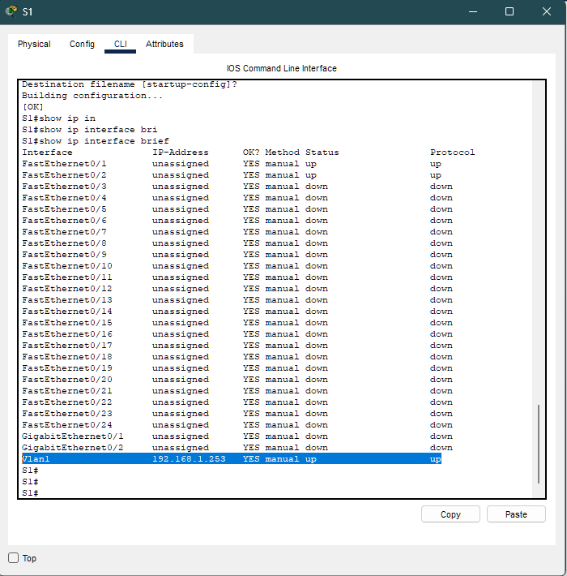
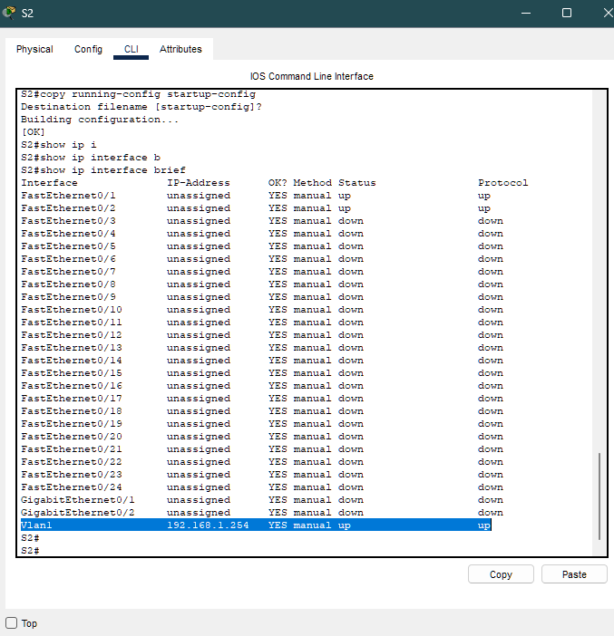
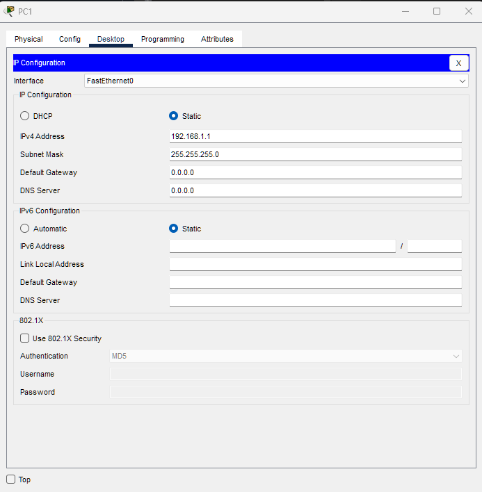
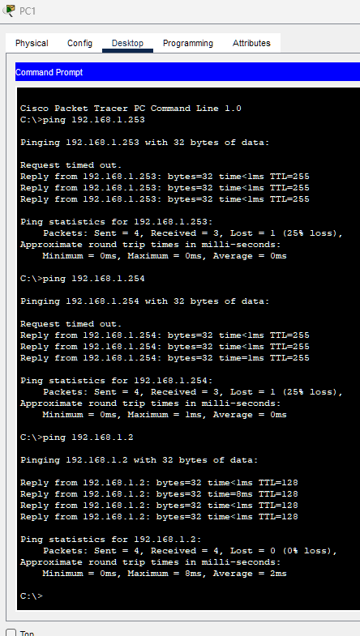

# 🌐 Implementação de Conectividade Básica

Este laboratório teve como objetivo configurar switches Cisco com endereços IP de gerenciamento (SVI), configurar PCs na mesma rede e validar a conectividade usando comandos `show` e `ping`.

---

## 📋 Tabela de Endereçamento

| Dispositivo | Interface | Endereço IP | Máscara |
|------------|----------|-------------|--------|
| S1 | VLAN 1 | 192.168.1.253 | 255.255.255.0 |
| S2 | VLAN 1 | 192.168.1.254 | 255.255.255.0 |
| PC1 | NIC | 192.168.1.1 | 255.255.255.0 |
| PC2 | NIC | 192.168.1.2 | 255.255.255.0 |

---
## 
📖 Conceito Importante 
Os switches podem funcionar sem nenhuma configuração inicial, pois encaminham quadros com base em endereços MAC (Media Access Control).
Ou seja:

- O switch não precisa de IP para comutar tráfego

- O IP é usado apenas para:

    - Gerenciamento remoto
    - Testes (ping, SSH, Telnet)
    - Monitoramento
    
O tráfego de rede em si funciona apenas com endereços MAC. 

---

## 🎯 Objetivos do Lab

- Configurar switches com hostname e IP de gerenciamento
- Configurar PCs com endereços IP estáticos
- Validar comunicação entre todos os dispositivos

---

# 🧩 Parte 1 — Configuração dos Switches

---

## 🔧 Switch S1

```bash
enable
configure terminal
hostname S1

interface vlan 1
ip address 192.168.1.253 255.255.255.0
no shutdown
end

copy running-config startup-config
```
📌 O que faz o comando no shutdown?
Por padrão, algumas interfaces ficam desativadas (administratively down).
➡ Ativa a interface
➡ Permite que ela comece a transmitir dados
Sem ele, a VLAN/interface continua desligada.

--- 

## ✔️ Verificação 
```bash
show ip interface brief
``` 

Resultado esperado:
```bash
Vlan1 192.168.1.253 up up
``` 


---
## 🔧 Switch S3

```bash
enable
configure terminal
hostname S2

interface vlan 1
ip address 192.168.1.254 255.255.255.0
no shutdown
end

copy running-config startup-config
```

--- 

## ✔️ Verificação 
```bash
show ip interface brief
``` 

Resultado esperado:
```bash
Vlan1 192.168.1.254 up up
``` 


---
## 💻 Parte 2 — Configuração dos PCs

PC1
```bash
IP: 192.168.1.1
Máscara: 255.255.255.0
```


PC2
```bash
IP: 192.168.1.2
Máscara: 255.255.255.0

```

--- 



--- 

## 📡 Parte 3 — Testes de Conectividade

De PC1:
```bash
ping 192.168.1.253
ping 192.168.1.254
ping 192.168.1.2

```


De PC2:
```bash
ping 192.168.1.1
ping 192.168.1.253
ping 192.168.1.254
```

Dos switches:
```bash
ping 192.168.1.1
ping 192.168.1.2

```



--- 

## ✅ Resultados

✔️ Switches configurados corretamente
✔️ PCs comunicando entre si
✔️ SVI funcionando como interface de gerenciamento
✔️ Conectividade total validada

---  

## 📚 Conceitos aplicados

- VLAN 1 como interface virtual de gerenciamento
- Endereçamento IP em LAN
- Comandos show
- Testes ICMP (ping)
- Configuração básica Cisco IOS


