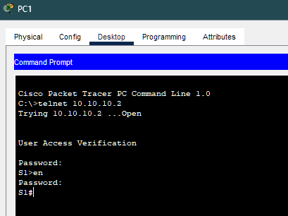
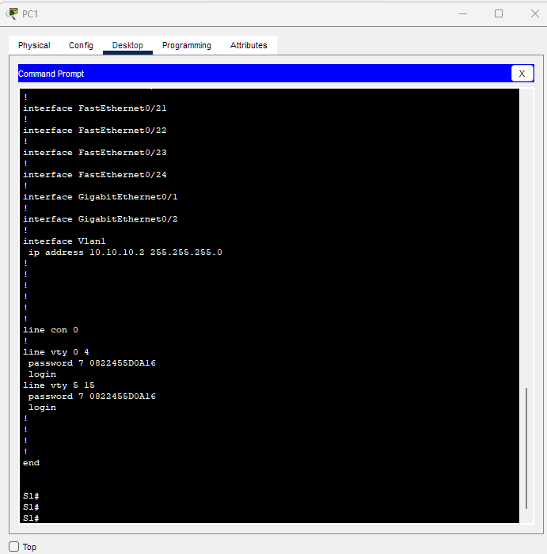
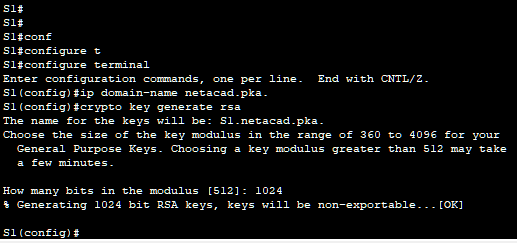
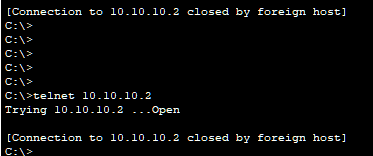

# 🔐 Configuração de Acesso Seguro com SSH

## 📡 Topologia e Endereçamento

| Dispositivo | Interface | Endereço IP | Máscara |
|------------|----------|-------------|---------|
| S1 | VLAN 1 | 10.10.10.2 | 255.255.255.0 |
| PC1 | NIC | 10.10.10.10 | 255.255.255.0 |

---

## 🎯 Objetivos

- Proteger senhas no switch  
- Implementar comunicação segura com SSH  
- Bloquear acesso remoto via Telnet  

---

## 🔒 Parte 1 – Proteção de Senhas

### Acesso inicial via Telnet (não seguro)

```bash
telnet 10.10.10.2
enable
```


--- 

### Salvar configuração atual

```bash
copy running-config startup-config
```

--- 

### Criptografar senhas

```bash
service password-encryption
```

✔️ Impede exibição de senhas em texto claro no running-config



### 🔐 Parte 2 – Configuração do SSH

Definir domínio IP
```bash
ip domain-name netacad.pka

```

### Gerar chave RSA (1024 bits)

```bash
crypto key generate rsa
```


### Criar usuário local

```bash
username administrator secret cisco
```

### Configurar VTY somente para SSH

```bash
line vty 0 15
 login local
 transport input ssh
 no password cisco
```
✔️ Remove Telnet

✔️ Habilita apenas acesso criptografado


## ✅ Parte 3 – Verificação

### Telnet (deve falhar)

```bash
telnet 10.10.10.2
```

### SSH (deve funcionar)

```bash
ssh -l administrator 10.10.10.2
```



### Salvar configuração final

```bash
copy running-config startup-config
```

### 🧠 Conceitos-Chave

| Protocolo | Segurança       |
| --------- | --------------- |
| Telnet    | ❌ Texto puro    |
| SSH       | ✅ Criptografado |

Por que usar SSH?
  - Protege credenciais
  -  Evita interceptação de dados
  - Padrão em ambientes profissionais
    
### ✅ Conclusão
Neste laboratório foi possível:

- Implementar criptografia de senhas
- Ativar autenticação local
- Substituir Telnet por SSH com segurança
  
Esse processo reflete boas práticas utilizadas em redes corporativas.

