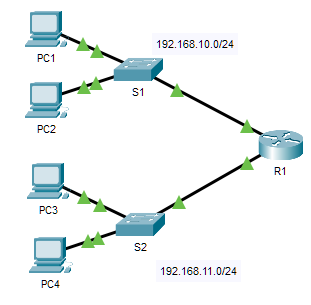

# 🧪 Packet Tracer – Solucionar Problemas de Gateway Padrão

## 🎯 Objetivo

- Documentar endereçamento de rede  
- Testar conectividade local e remota  
- Identificar falhas de gateway padrão  
- Aplicar metodologia de troubleshooting  

---

## 📋 Topologia 


---

## 📋 Tabela de Endereçamento

| Dispositivo | Interface | Endereço IP | Máscara | Gateway Padrão |
|------------|----------|------------|---------|---------------|
| R1 | G0/0 | 192.168.10.1 | 255.255.255.0 | N/D |
| R1 | G0/1 | 192.168.11.1 | 255.255.255.0 | N/D |
| S1 | VLAN 1 | 192.168.10.2 | 255.255.255.0 | __________ |
| S2 | VLAN 1 | 192.168.11.2 | 255.255.255.0 | __________ |
| PC1 | NIC | 192.168.10.10 | 255.255.255.0 | __________ |
| PC2 | NIC | 192.168.10.11 | 255.255.255.0 | __________ |
| PC3 | NIC | 192.168.11.10 | 255.255.255.0 | __________ |
| PC4 | NIC | 192.168.11.11 | 255.255.255.0 | __________ |

---

## 📖 Conceito

O gateway padrão é o endereço da interface do roteador conectada à rede local.  
Ele permite que dispositivos se comuniquem com redes diferentes.

---

# 🧩 Parte 1 – Verificação e Isolamento de Problemas

## ✅ Testes de Conectividade Local

| Teste | Funcionou? | Problema | Solução | Verificado |
|------|----------|---------|--------|-----------|
| PC1 → PC2 | ❌ | IP incorreto em PC1 | Corrigir IP | ✔ |
| PC1 → S1 | ❌  | IP incorreto em PC1 | Corrigir IP | ✔ |
| PC1 → R1 | ❌ | IP incorreto em PC1 | Corrigir IP | ✔ |
| PC3 → PC4 | ✅ | NA | NA | ✔ |
| PC3 → S2 | ❌ | IP incorreto em S2 | Corrigir IP | ✔ |

---

## 🌐 Testes de Conectividade Remota

```bash
ping 192.168.11.10
ping 192.168.11.11
```

---

### 🧠 Análise

- Conferência de IP
- Conferência de máscara
- Verificação de gateway padrão
- Testes progressivos

--- 

# 🛠 Parte 2 – Implementação das Soluções

Correções realizadas:
- Ajuste de endereços IP:
    - No PC1 estava incorreto
    - No S2 não estava atribuido VLAN 1
- Configuração correta de gateway padrão
    - No PC4 estava incorreto 
- Validação da comunicação entre redes

---  

### ✅ Verificação Final
| Teste     | Resultado |
| --------- | --------- |
| PC1 → PC2 | ✔         |
| PC1 → R1  | ✔         |
| PC1 → PC4 | ✔         |
| PC3 → PC1 | ✔         |

--- 

## 📌 Conclusão

- Gateway padrão é essencial para comunicação entre redes
- Documentação facilita troubleshooting
- Testes sistemáticos aceleram a resolução de problemas

--- 

## 🧠 Aprendizado

Sem gateway configurado corretamente, não há conectividade entre sub-redes.
